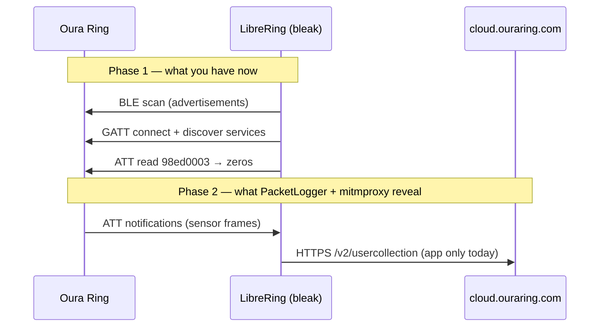

# Oura Ring BLE Protocol (LibreRing)

> Living document. Seeded from `scan_oura.py` capture of **Oura Ring 4** on macOS, 2026-07-06.
> Status: **Reconnaissance** — GATT surface mapped; packet formats and auth flow TBD.

---

## 1. Background: what problem are we solving?

Oura Ring collects biometric data (PPG heart rate, skin temperature, SpO₂, motion)
on-device, then syncs to Oura's cloud. The mobile app talks to the ring over
**Bluetooth Low Energy (BLE)**. LibreRing's goal is to speak that same BLE language
from your Mac, without the app or subscription — a classic **interoperability**
reverse-engineering project (legal under DMCA §1201(f) when you own the hardware
and do not distribute proprietary code).

You are building a **protocol stack**:

```
Physical radio → Link layer → L2CAP → ATT/GATT → Oura application protocol → Health data
```

Each layer has its own job. Lower layers are standardized by Bluetooth SIG; Oura's
secret sauce lives in the top layer (what bytes to write to `98ed0002`, how to parse
notifications from `98ed0003`).

---

## 2. Bluetooth LE concepts (the CS primer)

### 2.1 BLE vs Classic Bluetooth

**Classic Bluetooth** (BR/EDR) is for sustained high-bandwidth links (audio, file
transfer). **BLE** is for low power, bursty, small payloads — ideal for wearables.
Oura uses BLE only.

### 2.2 Roles: Central vs Peripheral

| Role | Device | Behavior |
|------|--------|----------|
| **Peripheral** | Oura Ring | Advertises presence, holds GATT server |
| **Central** | Mac / iPhone | Scans, connects, reads/writes GATT |

`bleak` on your Mac acts as **GATT client** (central). The ring is **GATT server**.

### 2.3 Advertising (before connection)

When not connected, the ring broadcasts **advertisement packets** ~every 100–1000 ms
containing:

- **Local name** — e.g. `Oura Ring 4`
- **Service UUIDs** — hints about available services (`98ed0001-…`)
- **Manufacturer data** — company ID + proprietary bytes

From your capture:

| Field | Value |
|-------|-------|
| Name | `Oura Ring 4` |
| Manufacturer ID | `0x02B2` (JouZen Oy) |
| Manufacturer payload | `04664801` |
| Advertised service | `98ed0001-a541-11e4-b6a0-0002a5d5c51b` |

**Manufacturer data** uses Bluetooth's assigned company identifiers. The first two
bytes (little-endian) are the company ID; the rest is vendor-defined. `04664801` likely
encodes ring model/firmware/state — still unknown.

### 2.4 Connection and GATT

After connecting, the central performs **GATT service discovery** — walking a tree:

```
Service (UUID)
  └── Characteristic (UUID + properties: read/write/notify/…)
        └── Descriptor (e.g. CCCD 0x2902 — enables notifications)
```

**Handles** are small integers (16, 17, 20…) assigned by the peripheral per connection.
They are **not stable across reboots** — always map handles → UUIDs from a fresh scan.

**UUIDs** are stable identifiers. Oura uses custom 128-bit UUIDs in the
`…-a541-11e4-b6a0-0002a5d5c51b` namespace.

### 2.5 ATT — Attribute Protocol

GATT rides on **ATT**. Every read/write/notify is an ATT PDU (Protocol Data Unit):

| Opcode | Name | Direction | Meaning |
|--------|------|-----------|---------|
| `0x0A` | Read Request | Central → Ring | "Give me value at handle N" |
| `0x0B` | Read Response | Ring → Central | Value bytes |
| `0x12` | Write Request | Central → Ring | Write with acknowledgment |
| `0x52` | Write Command | Central → Ring | Write without response |
| `0x1B` | Notification | Ring → Central | Unsolicited value push |
| `0x1D` | Indication | Ring → Central | Notification + must confirm |

PacketLogger / Wireshark show these as `btatt` frames. `parse_pklg.py` and
`dissectors/oura.lua` annotate them for Oura handles.

### 2.6 Notifications and CCCD

To receive notifications, the central writes `0x0001` to the **Client Characteristic
Configuration Descriptor** (`0x2902`) on that characteristic. Your scan shows all
CCC Ds at `0000` (notifications disabled) — expected before the Oura app subscribes.

### 2.7 MTU

**MTU** (Maximum Transmission Unit) caps bytes per ATT packet. Your connection: **247**
bytes ATT payload (common after MTU exchange). Large sensor dumps may be fragmented
across multiple notifications.

### 2.8 Security

Many characteristics return zeros or refuse access until **paired/authenticated**.
Oura uses a proprietary auth handshake (likely writes to `98ed0002`, responses on
`98ed0003`). Until auth succeeds, you only see the **pre-auth GATT surface** (what
`scan_oura.py` captured).

---

## 3. GATT service map (Oura Ring 4 — unauthenticated)

Captured 2026-07-06. Handles valid for that session only.

### 3.1 Primary Oura service

**UUID:** `98ed0001-a541-11e4-b6a0-0002a5d5c51b`  
**Handle:** 16

| Handle | UUID suffix | Properties | Community name | Notes |
|--------|-------------|------------|----------------|-------|
| 17 | `…0003` | read, notify | `RING_DATA_RX` | Read returned 244 zero bytes pre-auth |
| 20 | `…0002` | write, write-without-response | `RING_CMD_TX` | Command channel (app → ring) |
| 22 | `…0004` | read, write, notify, indicate | `RING_DATA_EXT` | Extended data + indicate |
| 25 | `…0005` | notify, write-without-response | `RING_NOTIFY_A` | Secondary stream |
| 28 | `…0006` | notify, write-without-response | `RING_NOTIFY_B` | Secondary stream |

Each notify-capable char has **CCCD** at handle+2 (`0x2902`).

### 3.2 Auxiliary service

**UUID:** `00060000-f8ce-11e4-abf4-0002a5d5c51b`  
**Handle:** 31

| Handle | UUID suffix | Properties | Notes |
|--------|-------------|------------|-------|
| 32 | `…0001` | write, notify, write-without-response | Possibly firmware/debug channel |

### 3.3 Services NOT visible (yet)

Standard services expected **after authentication**:

| UUID | SIG name | Typical use |
|------|----------|-------------|
| `0x180F` | Battery Service | Battery % — PRD "hello world" read |
| `0x180A` | Device Information | Firmware version, serial |
| `0x180D` | Heart Rate | Sometimes used on wearables |

Capture these by: (a) PacketLogger during Oura app sync, or (b) implementing auth.

---

## 4. Data flow architecture



**Two independent data paths:**

1. **BLE path** — raw bytes on characteristics (LibreRing target)
2. **HTTPS path** — JSON API to Oura cloud (reference for correlating metrics)

`correlate.py` (Prompt 9) will match timestamps between them.

---

## 5. Authentication flow

> **Status: UNKNOWN** — fill in from PacketLogger + app RE.

Expected pattern (from open_oura / Gadgetbridge-style wearables):

1. App generates or loads a **pairing key** (stored on phone)
2. App writes **auth challenge** to `98ed0002`
3. Ring responds on `98ed0003` (notify or read)
4. Subsequent commands encrypted or session-token based
5. Additional GATT services may appear post-auth

### Open questions

- [ ] Is pairing "Just Works" or passkey?
- [ ] Where is the key stored on iOS (Keychain)?
- [ ] Does Ring 4 differ from Ring 3/5 auth?

---

## 6. Packet format tables

> **Status: TBD** — populate from notification listener (Prompt 7) and pklg analysis.

### 6.1 Command frame (write → `98ed0002`)

| Offset | Size | Field | Description |
|--------|------|-------|-------------|
| — | — | — | Not yet mapped |

### 6.2 Data frame (notify ← `98ed0003`)

| Offset | Size | Field | Description |
|--------|------|-------|-------------|
| — | — | — | Not yet mapped |

---

## 7. Cloud API reference (HTTPS)

Captured via `capture_api.py` when iPhone proxy points at mitmproxy.

| Host | Path prefix | Purpose |
|------|-------------|---------|
| `cloud.ouraring.com` | `/v2/usercollection` | Sleep, readiness, activity aggregates |

**Note:** Certificate pinning in the Oura app may block some traffic; Frida bypass
or static analysis may be needed.

---

## 8. Firmware / hardware matrix

| Device | BLE name | Manufacturer payload | GATT notes |
|--------|----------|---------------------|------------|
| Ring 4 | `Oura Ring 4` | `04664801` | 2 services pre-auth (this doc) |
| Ring 5 | `Oura Ring 5` | `04766b01` (reported) | Same UUID family per open_oura |
| Ring 3 | `Oura Ring 3` | varies | Shared protocol with 4/5 |

---

## 9. Tooling cross-reference

| Tool | Input | Output | What you learn |
|------|-------|--------|----------------|
| `scan_oura.py` | Live ring | `services.json` | GATT tree, UUIDs, handles |
| PacketLogger | Live BLE | `.pklg` | Raw HCI/ATT bytes with timing |
| `parse_pklg.py` | `.pklg` | `.timeline.json` | Ordered ATT ops |
| `dissectors/oura.lua` | `.pklg` in Wireshark | Annotated packets | Visual protocol debug |
| `capture_api.py` | iPhone proxy | `captures/api/*.jsonl` | Cloud JSON schemas |

---

## 10. References

- [Bluetooth Core Specification](https://www.bluetooth.com/specifications/specs/) — ATT/GATT
- [Assigned Numbers](https://www.bluetooth.com/specifications/assigned-numbers/) — UUIDs, company IDs
- [open_oura](https://github.com/Th0rgal/open_oura) — community Oura BLE RE (Ring 3/4/5)
- [bleak documentation](https://bleak.readthedocs.io/)
- LibreRing `services.json` — canonical handle map for this ring session

---

## Changelog

| Date | Change |
|------|--------|
| 2026-07-06 | Initial map from Oura Ring 4 `scan_oura.py` run |
