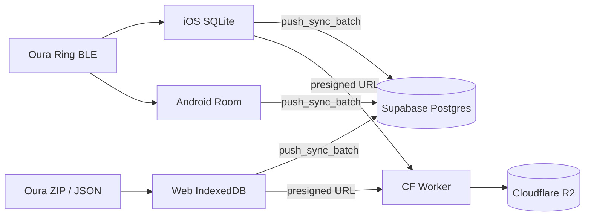

# Architecture

LibreRing is a **pnpm monorepo** with offline-first clients and an optional hybrid cloud backend.

```
laughing-chainsaw/
├── apps/
│   ├── web/          # Next.js static dashboard (GitHub Pages)
│   ├── ios/          # Swift/SwiftUI + CoreBluetooth + HealthKit
│   └── android/      # Kotlin/Compose scaffold (Phase 4)
├── packages/
│   ├── api-spec/     # OpenAPI contract (source of truth for RPC paths)
│   └── sdk-ts/       # TypeScript SDK (@librering/sdk)
├── backend/
│   ├── supabase/     # Postgres schema, RLS, sync RPCs
│   └── worker/       # Cloudflare Worker → R2 presigned URLs
├── core/
│   └── librering-core/  # Rust protocol (UniFFI for mobile)
└── tools/            # Python RE toolkit (not in cloud path)
```

## Design principles

| Principle | How we apply it |
|-----------|-----------------|
| **Offline-first** | Local DB (IndexedDB / SQLite / Room) is the source of truth |
| **Optional cloud** | Apps work without Supabase; cloud is backup + multi-device sync |
| **SOLID** | Auth/Sync/Storage are separate ports per platform (`AuthService`, `SyncRepository`, `StorageService`) |
| **Contract-first** | `packages/api-spec/openapi.yaml` defines RPC + Worker endpoints before client code |
| **Shared protocol** | `core/librering-core` (Rust) will replace duplicated Swift/Kotlin/Python BLE logic |

## Data flow



### What lives where

| Data type | Storage | Why |
|-----------|---------|-----|
| Auth sessions | Supabase Auth | Built-in JWT, email/password, refresh tokens |
| Health metrics (HR, sleep, steps…) | Supabase Postgres + RLS | Queryable, sync cursors, conflict via unique keys |
| Large exports / Oura ZIP backups | Cloudflare R2 | Cheap egress, no Supabase storage quota |
| Live BLE session | Device only | Never uploaded; auth key stays in Keychain |

## Client types

| App | Runtime | Local store | Deploy |
|-----|---------|-------------|--------|
| **Web** | Browser | Dexie (IndexedDB) | GitHub Pages static export |
| **iOS** | Native | SQLite | App Store / sideload |
| **Android** | Native | Room | Play Store (future) |

The web app does **not** talk to the ring over BLE. It imports Oura exports or JSON from iOS.

## Sync model

1. Client collects unsynced rows from local DB
2. `push_sync_batch(device_id, cursor, batches)` — idempotent inserts (unique on `user_id + timestamp`)
3. `pull_sync_delta(device_id, since_cursor)` — fetch remote changes
4. Cursor stored locally per device

See [BACKEND.md](./BACKEND.md) for SQL and RPC details.

## Backend choice: hybrid (Supabase + R2)

We use **Supabase for auth + Postgres** and **Cloudflare R2 for blobs**, not pure “Option A” (everything on Cloudflare).

See [BACKEND_COMPARISON.md](./BACKEND_COMPARISON.md) for the full matrix including why Supabase appears alongside R2.

## Related docs

- [BACKEND.md](./BACKEND.md) — setup Supabase + Worker
- [CLIENTS.md](./CLIENTS.md) — per-platform dev guide
- [CONTRIBUTING.md](./CONTRIBUTING.md) — how to extend the codebase
