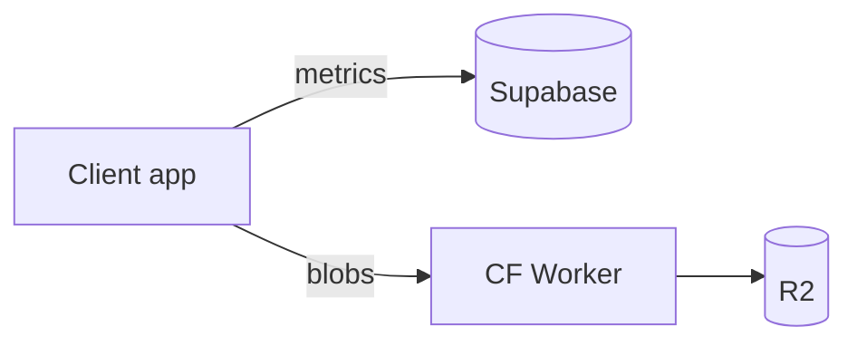

# Core Concepts

This page explains the ideas behind LibreRing — useful for contributors and anyone evaluating the project.

## Mission

Oura Ring hardware stores rich health data locally and broadcasts it over BLE. The official app uploads that data to Oura's cloud and gates features behind a **$6/month subscription**.

LibreRing's mission is **interoperability**: if you own the ring, you should read your own sensor data without a recurring fee.

## Design principles

### 1. Offline-first

Local storage is the **source of truth**:

| Platform | Local store |
|----------|-------------|
| Web | IndexedDB (Dexie) |
| iOS | SQLite |
| Android | Room (planned) |

Cloud sync is **optional backup**, not a requirement. The iOS app and web dashboard work without Supabase configured.

### 2. Optional cloud (hybrid backend)

When enabled, structured metrics go to **Supabase Postgres** and large exports go to **Cloudflare R2**:

Why hybrid? See [Backend Comparison](BACKEND_COMPARISON.md).

### 3. Contract-first API

`packages/api-spec/openapi.yaml` defines RPC and Worker endpoints before client code. TypeScript SDK implements ports:

| Port | Responsibility |
|------|----------------|
| `AuthService` | Sign up, sign in, session |
| `SyncService` | Push/pull health batches |
| `StorageService` | R2 presigned URLs |

SOLID: clients depend on interfaces, not Supabase/Worker directly.

### 4. Shared protocol core

BLE packet parsing lives in three places today (Python, Swift, Rust). **`core/librering-core`** (Rust + UniFFI) will become the single source of truth for iOS and Android.

### 5. Clean-room reverse engineering

LibreRing reads **publicly broadcast BLE GATT characteristics** from hardware the user owns. We do not:

- Distribute Oura proprietary code or firmware
- Bypass encryption on third-party content
- Circumvent access controls on Oura's servers

See [legal.md](legal.md) for the full interoperability statement.

## Sync model

Sync is **idempotent** — safe to run repeatedly.

1. Client registers a **device** row in Supabase (`Web Dashboard`, `iPhone`, etc.)
2. **Push:** `push_sync_batch(device_id, cursor, batches)` — inserts with unique keys; duplicates skipped
3. **Pull:** `pull_sync_delta(device_id, since_cursor)` — fetches remote rows
4. **Cursor** stored per device in `sync_cursors`

Clicking **Sync Now** twice shows `Already up to date` — not duplicate rows.

## Data ownership

| Data | Stays local | Optional cloud |
|------|:-----------:|:--------------:|
| BLE auth key (`key.hex`) | ✅ never uploaded | — |
| Live HR / sleep samples | ✅ | ✅ backup |
| Oura ZIP exports | ✅ | ✅ R2 backup |
| Account password | — | ✅ Supabase Auth |

## Client roles

| App | Role |
|-----|------|
| **iOS** | Primary ring interface — BLE, HealthKit, on-device scoring |
| **Web** | Dashboard + Oura export import — no BLE |
| **Android** | Future parity with iOS |
| **tools/** | Research CLIs — not shipped to end users |

## Terminology

| Term | Meaning |
|------|---------|
| **Auth key** | 16-byte BLE pairing secret (`key.hex`) |
| **GATT** | BLE service/characteristic layout |
| **RLS** | Supabase Row Level Security — users see only their rows |
| **Cursor** | Opaque sync token (ISO timestamp in v1) |
| **Batch** | `{ table, records[] }` payload for one metric type |

## Further reading

- [Architecture](ARCHITECTURE.md)
- [Client development](CLIENTS.md)
- [BLE Protocol](protocol.md)
